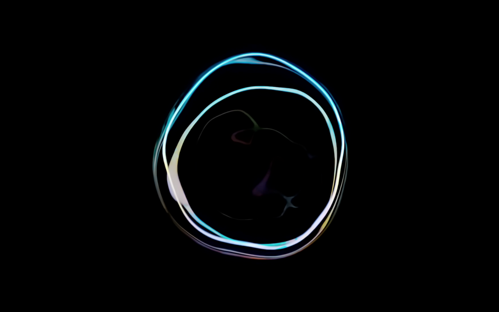

# SwiftBubble - A Mac OS X Screen Saver

The Screen Saver was inspired by Apple's promotional videos for the new retina MacBook 12".  
Motivation was that the Screen Saver is not included with any current Apple device or OS.
It is implemented with Swift and Quartz Composer but Photoshop had the biggest workload.  

[ Click Here to Download it ](https://github.com/nemesit/SwiftBubble/releases/download/1.1/SwiftBubble.zip)

Preview:  

Copyright ©2015 Felix Grabowski  

